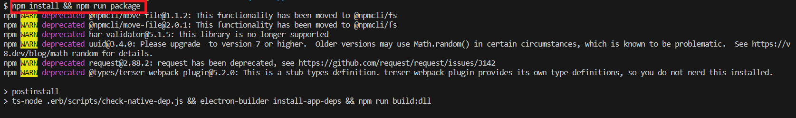
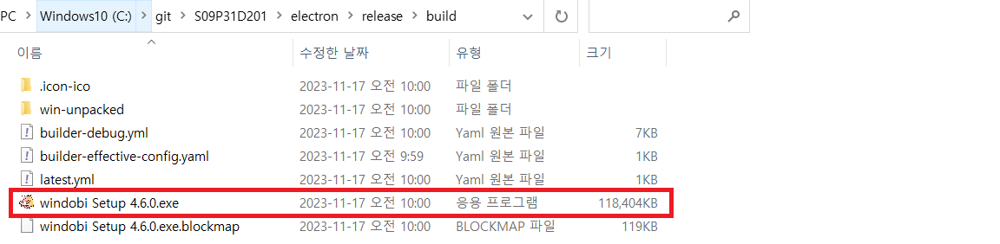

# 포팅 메뉴얼

## 패키지화

### 1. npm install && npm run package
- 명령어 실행을 통해 소스코드를 패키지화합니다.

## 프로그램 설치
### 2. electron/release/build 내의 windobi Setup 파일을 실행
- 프로그램 실행을 통해 프로그램을 설치합니다.

## 프로그램 실행
### 3. 바탕화면의 바로가기 아이콘을 통해 실행
- 바로가기를 통해 프로그램을 실행합니다.  
 

